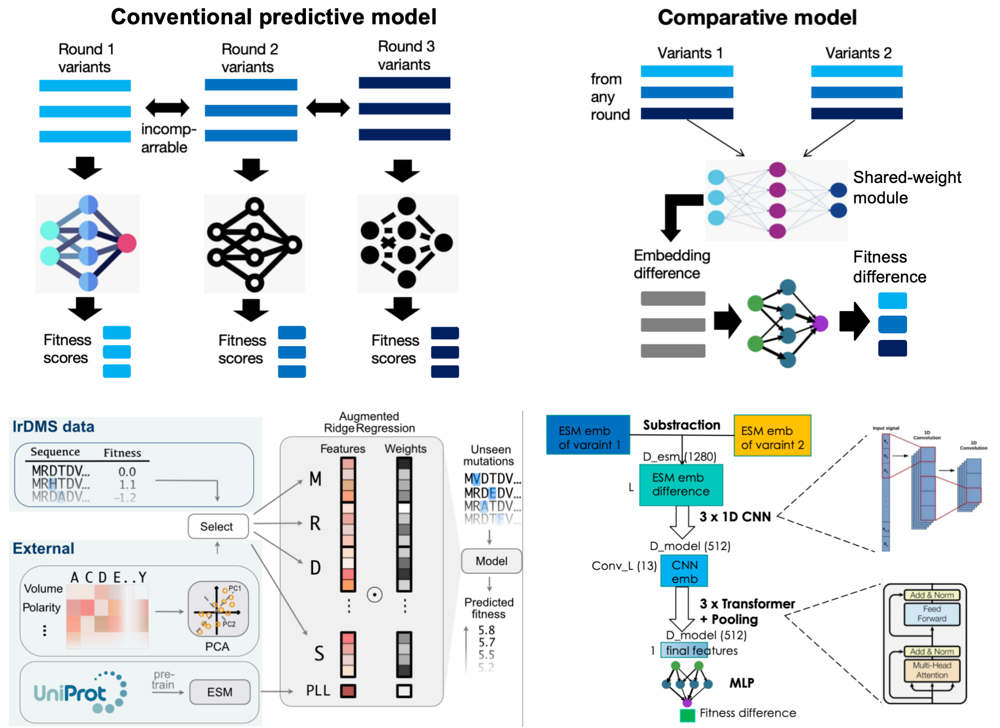

# CT-Contrastive: a contrastive LLM approach to guide the directed evolution of enzymes
--------

Enzyme evolution is far from a solved problem --- 3D diffusion/MF-based method can only hallucinate based on known motif scaffolds & residues, but fail to optimize/diversify enzyme-substrate contacting pose & reactions; sequence-based approaches can optimize enzyme residues based on fitness data, but fail to utilize/correct data from different evolutionary batch/round. Here we design a contrastive protein LLM approach to tackle these challenges by learning the granularity between evolutionary events/mutations along the directed evolution trajectory, and utilized the pipeline to suggest mutations for a recently discovered metallo-esterase [Studer et al. Science](https://www.science.org/doi/10.1126/science.aau3744)

## Environment setup
## Data preprocessing
## Protein embedding
## Model training
## Model evaluation
## Inference/ Mutation Suggestion
